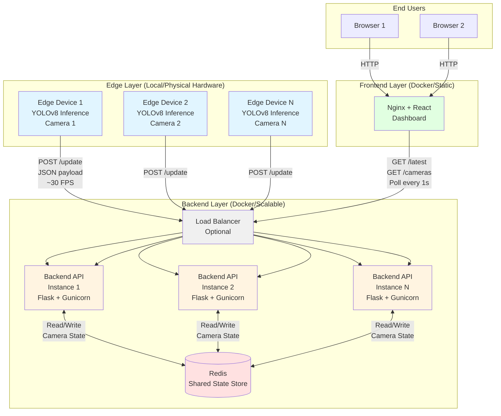
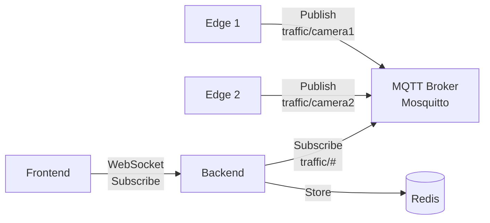

# Traffic System ML - Architecture & Scaling

## System Overview

This is a **real-time traffic monitoring system** with edge AI inference, scalable backend API, and live dashboard visualization.

### Components

1. **Edge (Inference Engine)** - Local Python service
   - Runs YOLOv8 object detection on camera streams
   - Processes video frames in real-time (20-30 FPS)
   - Computes traffic metrics (vehicle count, congestion, lane distribution)
   - Sends JSON payloads to backend via HTTP POST every frame
   - Stateless - each edge device operates independently

2. **Backend (Flask API)** - Dockerized
   - Receives detection data from multiple edge devices
   - Stores latest state per camera_id in Redis (or in-memory fallback)
   - Serves REST API endpoints for frontend queries
   - Horizontally scalable with Redis as shared state

3. **Frontend (React Dashboard)** - Dockerized
   - Real-time dashboard with live metrics visualization
   - Polls backend every 1 second for updates
   - Supports multi-camera selection
   - Falls back to demo mode if backend unavailable

4. **Redis** - Dockerized
   - Shared state store for camera data
   - Enables horizontal scaling of backend replicas
   - Persistent storage for traffic analytics

---

## System Architecture Diagram



---

## Data Flow

### 1. Edge → Backend (Write Path)

```
Camera Stream → YOLOv8 Model → Detections → Metrics Computation → HTTP POST
```

**Payload Example (sent every frame):**
```json
{
  "camera_id": "camera_1",
  "fps": 28.5,
  "num_detections": 12,
  "detections": [
    {"class_name": "car", "confidence": 0.95, "bbox": [100, 200, 50, 80]},
    {"class_name": "truck", "confidence": 0.88, "bbox": [300, 150, 90, 120]}
  ],
  "metrics": {
    "vehicle_count": 12,
    "congestion_score": 0.65,
    "class_distribution": {"car": 8, "truck": 2, "bus": 2},
    "lane_wise": {"left": 3, "middle": 6, "right": 3}
  },
  "alerts": {
    "congestion_alert": true,
    "accident_alert": false
  }
}
```

**Backend Processing:**
1. Receives POST request at `/update`
2. Extracts `camera_id` from payload
3. Stores in Redis: `camera:camera_1 → {data: ..., last_update: timestamp}`
4. Adds camera_id to set: `cameras → {camera_1, camera_2, ...}`
5. Returns acknowledgment

### 2. Frontend → Backend (Read Path)

```
User Browser → Nginx → Backend API → Redis → JSON Response
```

**API Calls (every 1 second):**
- `GET /cameras` - List all active cameras
- `GET /latest?camera_id=camera_1` - Fetch latest data for selected camera

**Backend Processing:**
1. Receives GET request
2. Queries Redis: `HGETALL camera:camera_1`
3. Returns cached JSON (no computation)
4. If Redis unavailable, falls back to in-memory dict

---

## Scaling Strategy

### Current Setup (Development)
```
1 Edge Device → 1 Backend Instance → 1 Frontend Container → 1 Redis
```

### Production Scaling (Horizontal)

#### Backend Scaling (Stateless Replicas)
```bash
# Docker Compose with replicas
docker compose up --scale backend=3
```

Or with Docker Swarm:
```yaml
services:
  backend:
    deploy:
      replicas: 5
      resources:
        limits:
          cpus: '0.5'
          memory: 512M
```

**Why it scales:**
- Backend is **stateless** - all state lives in Redis
- Multiple backend instances share same Redis
- Load balancer distributes traffic (Nginx, Traefik, HAProxy)
- No session affinity required (any backend can serve any request)

#### Edge Scaling (Independent Devices)
- Deploy 1 edge device per camera
- Each edge device has unique `CAMERA_ID`
- All edge devices POST to same backend endpoint
- No coordination needed between edge devices

```bash
# Camera 1
export CAMERA_ID=camera_1
export STREAM_URL=rtsp://192.168.1.10/stream
python inference/run_inference.py &

# Camera 2
export CAMERA_ID=camera_2
export STREAM_URL=rtsp://192.168.1.11/stream
python inference/run_inference.py &

# Camera N...
```

#### Frontend Scaling (Static Content)
- Frontend is static HTML/CSS/JS after build
- Serve from CDN (CloudFront, Cloudflare)
- Or multiple Nginx replicas behind load balancer
- No backend state needed

#### Redis Scaling (Persistence + HA)

**Option 1: Redis Sentinel (High Availability)**
```yaml
redis-master:
  image: redis:7-alpine

redis-replica-1:
  image: redis:7-alpine
  command: redis-server --replicaof redis-master 6379

sentinel:
  image: redis:7-alpine
  command: redis-sentinel /etc/sentinel.conf
```

**Option 2: Redis Cluster (Sharding)**
- Horizontal partitioning across nodes
- Automatic failover
- 1000+ operations/sec throughput

**Option 3: Managed Redis**
- AWS ElastiCache
- Redis Cloud
- Google Cloud Memorystore

---

## Performance Characteristics

### Edge (Inference)
- **Throughput**: 20-30 FPS per camera (GPU), 5-10 FPS (CPU)
- **Latency**: 30-50ms per frame (GPU), 100-200ms (CPU)
- **Network**: ~1KB JSON per frame → ~30KB/s per camera
- **GPU Memory**: ~2GB VRAM for YOLOv8s

### Backend (API)
- **Throughput**: 10,000+ req/sec per instance (simple GET/POST)
- **Latency**: <5ms (Redis hit), <1ms (in-memory)
- **Memory**: ~100MB per instance + Redis overhead
- **CPU**: Minimal (no computation, just I/O)

### Redis (State Store)
- **Throughput**: 100,000+ ops/sec (single instance)
- **Latency**: <1ms for GET/SET
- **Memory**: ~1KB per camera state × number of cameras
- **Persistence**: RDB snapshots + AOF for durability

### Frontend (Dashboard)
- **Load**: 1 request/sec per active user
- **Bandwidth**: ~2KB/s per user (polling overhead)
- **CDN-friendly**: 99% cache hit rate on static assets

---

## Scaling Limits

| Component | Single Instance | Scaled Limit | Bottleneck |
|-----------|----------------|--------------|------------|
| Edge | 1 camera | Unlimited (independent) | GPU/CPU per device |
| Backend | ~10K req/s | ~100K req/s (10 replicas) | Redis throughput |
| Redis | ~100K ops/s | ~1M ops/s (cluster) | Network I/O |
| Frontend | ~1K users | Unlimited (CDN) | None |

### When to Scale

**Scale Backend when:**
- Average response time > 50ms
- CPU utilization > 70% across all instances
- Request queue depth increasing

**Scale Redis when:**
- Memory utilization > 80%
- Ops/sec approaching 80K (leave headroom)
- Network bandwidth saturated

**Scale Edge when:**
- Adding new cameras (1:1 scaling)
- FPS drops below target (upgrade GPU)

---

## Deployment Topologies

### Topology 1: Single Server (Dev/Demo)
```
┌─────────────────────────────┐
│     Single Machine          │
│  ┌──────────────────────┐  │
│  │ Docker Compose       │  │
│  │ - Redis              │  │
│  │ - Backend            │  │
│  │ - Frontend           │  │
│  └──────────────────────┘  │
│  ┌──────────────────────┐  │
│  │ Local Python         │  │
│  │ - Edge Inference     │  │
│  └──────────────────────┘  │
└─────────────────────────────┘
```

### Topology 2: Multi-Camera Edge
```
┌──────────────┐   ┌──────────────┐   ┌──────────────┐
│ Edge Site 1  │   │ Edge Site 2  │   │ Edge Site N  │
│ - Camera 1   │   │ - Camera 2   │   │ - Camera N   │
│ - YOLOv8     │   │ - YOLOv8     │   │ - YOLOv8     │
└──────┬───────┘   └──────┬───────┘   └──────┬───────┘
       │                  │                   │
       └──────────────────┼───────────────────┘
                          │ HTTPS/POST
                          ▼
              ┌───────────────────────┐
              │   Cloud Backend       │
              │   - Load Balancer     │
              │   - Backend × 3       │
              │   - Redis Cluster     │
              │   - Frontend (CDN)    │
              └───────────────────────┘
```

### Topology 3: Enterprise (Kubernetes)
```
┌─────────────────── Kubernetes Cluster ──────────────────┐
│                                                          │
│  Ingress Controller (Nginx/Traefik)                     │
│         │                                                │
│         ├─► Backend Service (Deployment)                │
│         │    └─ Pods × 5 (auto-scaled)                  │
│         │                                                │
│         ├─► Frontend Service (Deployment)               │
│         │    └─ Pods × 2 (static content)               │
│         │                                                │
│         └─► Redis StatefulSet                           │
│              └─ Master + Replicas (HA)                   │
│                                                          │
└──────────────────────────────────────────────────────────┘
            ▲
            │ HTTPS/POST from Edge Devices
            │
  ┌─────────┴─────────┬──────────────┐
  │                   │              │
Edge 1              Edge 2        Edge N
```

---

## Communication Protocols

### Current: REST over HTTP
- **Edge → Backend**: `POST /update` (fire-and-forget, 0.05s timeout)
- **Frontend → Backend**: `GET /latest`, `GET /cameras` (1s polling interval)

**Pros:**
- Simple, stateless, widely supported
- Easy debugging (curl, browser tools)
- Works with standard load balancers
- No broker overhead

**Cons:**
- Polling overhead (1 req/s per user)
- No push notifications to frontend
- Edge must retry on failure

### Alternative: MQTT (Pub/Sub)



**When to use MQTT:**
- Intermittent connectivity (cellular edge devices)
- Low bandwidth environments (uses binary protocol)
- Need QoS guarantees (at-least-once delivery)
- Push notifications to frontend (via WebSocket bridge)

**Trade-offs:**
- Adds broker dependency (Mosquitto, EMQ X)
- More complex debugging
- Requires WebSocket gateway for browser clients

---

## Current Implementation Status

✅ **Implemented:**
- Edge inference with YOLOv8 tracking
- Backend API with Redis + in-memory fallback
- Multi-camera support
- Real-time metrics computation
- REST API with CORS
- Dockerized backend + frontend
- Horizontal scaling ready (stateless backend)

🚧 **Not Yet Implemented:**
- Load balancer configuration
- Backend auto-scaling (K8s HPA)
- Redis persistence/HA setup
- Authentication/API keys
- HTTPS/TLS certificates
- Metrics monitoring (Prometheus/Grafana)
- Log aggregation (ELK stack)

---

## Monitoring & Observability

### Recommended Additions

**Application Metrics:**
```python
# Backend: Add Prometheus metrics
from prometheus_client import Counter, Histogram

request_count = Counter('backend_requests_total', 'Total requests')
request_latency = Histogram('backend_request_duration_seconds', 'Request latency')
```

**Infrastructure Metrics:**
- CPU/Memory per container (cAdvisor)
- Redis ops/sec, memory usage (Redis INFO)
- Edge inference FPS, GPU utilization (nvidia-smi)
- Network throughput (iftop, netdata)

**Logging:**
- Centralized logs (Fluentd → Elasticsearch)
- Structured JSON logging
- Correlation IDs across services

**Alerting:**
- Backend response time > 100ms
- Redis memory > 80%
- Edge FPS < 15
- Camera disconnected > 30s

---

## Security Considerations

### Current State: Open/Insecure
⚠️ **No authentication on any endpoint** - suitable for local development only

### Production Hardening

1. **Edge → Backend Authentication**
   ```python
   # Add API key header
   headers = {"X-API-Key": os.getenv("API_KEY")}
   requests.post(backend_url, json=output, headers=headers)
   ```

2. **Frontend → Backend CORS**
   ```python
   # Restrict origins
   CORS(app, origins=["https://yourdomain.com"])
   ```

3. **TLS/HTTPS**
   - Use Nginx/Traefik as TLS termination proxy
   - Let's Encrypt for certificates

4. **Redis Password**
   ```bash
   REDIS_URL=redis://:password@redis:6379/0
   ```

5. **Rate Limiting**
   ```python
   from flask_limiter import Limiter
   limiter = Limiter(app, default_limits=["100 per minute"])
   ```

---

## Cost Estimation (AWS Example)

### Small Deployment (10 cameras)
- **Edge**: 10× self-hosted devices (~$500 each = $5,000 one-time)
- **Backend**: 2× t3.medium EC2 instances ($60/month)
- **Redis**: ElastiCache t3.small ($40/month)
- **Frontend**: S3 + CloudFront ($10/month)
- **Total**: ~$110/month + $5,000 upfront

### Medium Deployment (100 cameras)
- **Edge**: 100× devices ($50,000 one-time)
- **Backend**: 5× t3.large EC2 instances ($400/month)
- **Redis**: ElastiCache r6g.large ($150/month)
- **Load Balancer**: ALB ($25/month)
- **Frontend**: S3 + CloudFront ($50/month)
- **Total**: ~$625/month + $50,000 upfront

### Large Deployment (1000 cameras)
- **Edge**: 1000× devices ($500,000 one-time)
- **Backend**: EKS cluster + 20× t3.xlarge ($2,500/month)
- **Redis**: ElastiCache cluster ($800/month)
- **Managed Kubernetes**: EKS control plane ($150/month)
- **CDN**: CloudFront ($200/month)
- **Total**: ~$3,650/month + $500,000 upfront

---

## Conclusion

This system is designed for **horizontal scalability** with:
- **Stateless backend** replicas sharing Redis state
- **Independent edge** devices per camera
- **Static frontend** for CDN distribution
- **REST API** for simplicity and debuggability

Scale by adding more backend instances as traffic grows. Redis is the only stateful component and can be clustered or managed via cloud services.

For enterprise deployments, add authentication, monitoring, and deploy to Kubernetes with auto-scaling policies.
